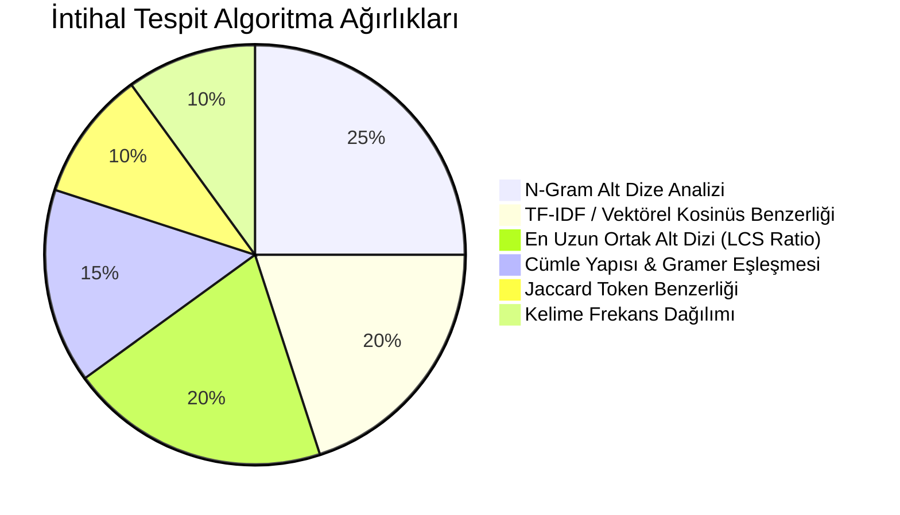
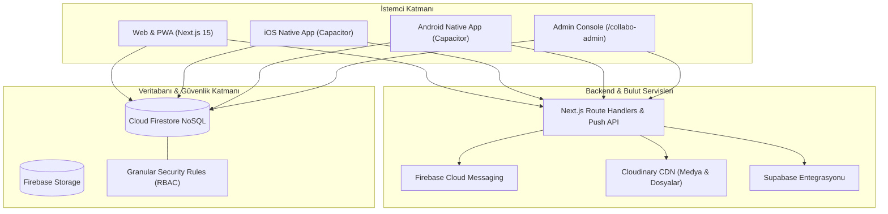

<div align="center">

# 🚀 Collabo (Kurmay) — Next-Gen Real-Time Collaborative Workspace & Education Ecosystem

<p align="center">
  <strong>Dijital panolar, görev & ödev yönetimi, 6-vektörlü intihal tespit motoru, anlık mesajlaşma ve Capacitor tabanlı çapraz platform (iOS, Android, Web, PWA) ortak çalışma ekosistemi.</strong>
</p>

[](https://nextjs.org)
[](https://react.dev)
[](https://capacitorjs.com/)
[](https://firebase.google.com/)
[](https://www.typescriptlang.org/)
[](https://tailwindcss.com)
[](https://threejs.org/)
[](https://opensource.org/licenses/MIT)

<br/>

<a href="#-proje-hakkında">Proje Hakkında</a> •
<a href="#-temel-özellikler">Özellikler</a> •
<a href="#-intihal-tespit-motoru">İntihal Motoru</a> •
<a href="#-sistem-mimarisi">Mimari</a> •
<a href="#-teknoloji-yığını">Teknoloji Yığını</a> •
<a href="#-proje-yapısı">Klasör Yapısı</a> •
<a href="#-kurulum-ve-çalıştırma">Kurulum</a> •
<a href="#-mobil-ve-cicd">Mobil & CI/CD</a> •
<a href="#-lisans">Lisans</a>

---

</div>

## 📖 Proje Hakkında

**Collabo (Kurmay)**; ekipler, eğitim kurumları, öğretmenler ve öğrenciler için geliştirilmiş çok katmanlı, gerçek zamanlı bir dijital çalışma ve iş birliği platformudur.

Platform; serbest formlu dijital panolar (Boards), sürükle-bırak kart mimarisi (@dnd-kit), zengin metin düzenleme (Tiptap), ödev/görev teslim süreçleri, çoklu algoritmaya sahip gelişmiş intihal analiz motoru, gerçek zamanlı sohbet ve Capacitor ile iOS & Android mağaza dağıtımı desteğini tek bir monorepo altında birleştirir.

---

## ✨ Temel Özellikler

### 📌 1. İnteraktif Panolar & Not Mimarisi (Interactive Boards)
- 🗂️ **Dinamik Bölümler & Sütunlar:** `@dnd-kit` destekli, akıcı sürükle-bırak (Drag & Drop) kart ve bölüm yönetimi.
- 📝 **Çok Formatlı Not Kartları:**
  - **Zengin Metin (Rich Text):** Tiptap Markdown destekli formatlama, kod blokları ve bağlantılar.
  - **Medya & Dosyalar:** Cloudinary entegrasyonu, görsel galerisi, Lightbox önizleme ve çoklu dosya indirme (JSZip).
  - **Akıllı Bağlantı Önizlemeleri (OpenGraph):** Sunucu taraflı başlık, görsel ve alan adı çıkarımı (`cheerio` + `/api/link-preview`).
  - **Anketler & Etkileşim:** Çoktan seçmeli oylama kartları.
- 🎨 **Özelleştirilebilir Arka Planlar:** Degrade renk geçişleri, görsel temalar ve Three.js / React Three Fiber ile 3D görsel efektler.

---

### 🎓 2. Ödev, Görev & Teslim Yönetimi (Assignments & Tasks)
- 👨‍🏫 **Öğretmen & Eğitmen Paneli:** Görev oluşturma, teslim tarihi tanımlama, dosya eki ekleme ve öğrenci ilerlemesini canlı takip etme.
- 👨‍🎓 **Öğrenci Teslim Arayüzü:** Zengin metin ve dosya yükleme destekli ödev teslimi.
- 📊 **Notlandırma & Geri Bildirim:** Öğretmen özel değerlendirme alanı, puanlama ve öğrenciye özel geri bildirim iletimi.

---

### 🧠 3. Çok Vektörlü Akıllı İntihal Tespit Motoru (Plagiarism Engine)
Ödev teslimlerindeki kopyalama ve benzerlik oranlarını 6 farklı metin işleme algoritmasının ağırlıklı bileşimiyle analiz eder:



- 🚨 **Risk Seviyeleri:** *Düşük (Yeşil), Orta (Sarı), Yüksek (Turuncu), Kritik (Kırmızı).*
- 🔍 **Cümle Bazlı Vurgulama:** Benzer bulunan ortak ifadelerin metin içerisinde interaktif olarak renklendirilmesi.
- ⚡ **Toplu Tarama (Bulk Check):** Sınıftaki tüm teslimlerin tek tıkla birbiriyle çapraz karşılaştırılması.

---

### 💬 4. Gerçek Zamanlı İletişim & Sosyal Etkileşim
- 🚪 **Pano İçi Canlı Sohbet (Chat Drawer):** Pano üyeleri arasında anlık mesajlaşma.
- 💭 **Not Yorumları & Yanıt Dizileri:** Kartlara özel yorum alanı, `@kullanıcı` etiketleme (Mentions) ve emoji reaksiyonları.
- 🟢 **Canlı Varlık & Çevrim İçi Durumu (Presence System):** Panoda anlık olarak bulunan aktif üyelerin tespiti.

---

### 🔔 5. Çok Kanallı Bildirim Sistemi
- 📱 **Native Push Bildirimleri:** Capacitor Push Notifications & Firebase Cloud Messaging (FCM).
- ⚙️ **Kişiselleştirilebilir Tercihler:** Yorum yanıtları, etiketlenmeler, yeni ödevler ve pano davetleri için ayrı ayrı açılıp kapatılabilen bildirim ayarları.

---

### 🎛️ 6. Collabo Admin Yönetim Portali (`/collabo-admin`)
- 📊 Sistem geneli aktivite logları (Activity Audit Logs).
- 👥 Kullanıcı yönetimi, rol atama (`teacher`, `student`, `admin`) ve kural ihlalinde hesap askıya alma (Suspension).
- 📋 Tüm panoların yaşam döngüsü denetimi ve sistem bakım modu yönetimi (Maintenance Guard).

---

## 🏗️ Sistem Mimarisi



---

## 🛠️ Teknoloji Yığını

| Alan | Teknoloji | Açıklama |
| :--- | :--- | :--- |
| **Frontend Framework** | **Next.js 15.5 (App Router)** | SSR, Hibrit İstemci/Sunucu Mimarisi & API Routes |
| **Kullanıcı Arayüzü** | **React 19, Tailwind CSS v3.4** | Modern responsive bileşenler, Tailwind Typography |
| **Mobil Çalışma Zamanı** | **Capacitor 8.0** | iOS & Android yerel köprüsü, Haptics, Status Bar, Push |
| **Sürükle-Bırak** | **@dnd-kit (Core, Sortable)** | Performanslı ve erişilebilir kanban sürükle-bırak |
| **Zengin Metin Editörü** | **Tiptap 3.13** | Markdown, Link, Underline, Placeholder eklentileri |
| **3D & Animasyon** | **Three.js, React Three Fiber, Drei** | İnteraktif 3D pano efektleri ve görsel derinlik |
| **Veritabanı & Auth** | **Firebase (Auth, Firestore, Storage)** | Gerçek zamanlı NoSQL veri akışı ve güvenli kimlik doğrulama |
| **İntihal & NLP** | **Özel 6-Vektörlü Algoritma** | N-Gram, Jaccard, Kosinüs, LCS ve gramer analizi |
| **Durum Yönetimi** | **Zustand 4.4** | Hafif ve performanslı istemci durum yönetimi |
| **İkon Seti** | **Lucide React** | Temiz, tutarlı vektörel arayüz simgeleri |

---

## 📂 Proje Yapısı

```text
kurmay-3/
├── android/                           # Capacitor Android Studio yerel projesi
├── ios/                               # Capacitor iOS Xcode yerel projesi (CocoaPods)
├── collabo-admin/                     # Next.js 16 Yönetici Paneli (Ayrı Web Uygulaması)
│   ├── app/                           # Admin App Router (Activity, Boards, Settings, Users)
│   └── package.json
│
├── src/                               # Ana Uygulama Kaynak Kodları (Next.js 15)
│   ├── app/                           # App Router sayfaları
│   │   ├── admin/                     # Rol ve pano yönetim sayfaları
│   │   ├── api/                       # Push bildirimi, Cloudinary ve Link önizleme API'leri
│   │   ├── auth/                      # Login, Register, Parola Sıfırlama
│   │   ├── board/[id]/                # Ana Pano ve Kanban çalışma alanı
│   │   ├── dashboard/                 # Kullanıcı pano listesi ve özet ekranı
│   │   └── messages/                  # Doğrudan mesajlaşma merkezi
│   │
│   ├── components/                    # Zengin UI ve Modal Bileşenleri
│   │   ├── RichTextEditor.tsx         # Tiptap zengin metin düzenleyici
│   │   ├── Section.tsx                # Sürükle-bırak destekli pano sütunları
│   │   ├── NoteCard.tsx               # Çok formatlı not kartları
│   │   ├── AssignmentsModal.tsx       # Ödev oluşturma ve teslim paneli
│   │   ├── ChatDrawer.tsx             # Canlı sohbet çekmecesi
│   │   └── PushNotificationInitializer.tsx # Mobil bildirim dinleyicisi
│   │
│   ├── lib/                           # İş Mantığı & Algoritmalar
│   │   ├── plagiarism.ts              # 6-Vektörlü intihal analiz motoru
│   │   ├── assignments.ts             # Ödev teslim ve puanlama servisleri
│   │   ├── boards.ts & notes.ts       # Pano ve not veri katmanı
│   │   └── firebase.ts                # Firebase Client SDK yapılandırması
│   │
│   ├── store/                         # Zustand Global State
│   └── types/                         # TypeScript tip tanımları ve arayüzler
│
├── firestore.rules                    # Kapsamlı Firestore güvenlik kuralları (~19 KB)
├── capacitor.config.ts                # Capacitor mobil yapılandırması
├── codemagic.yaml                     # Otomatik iOS/Android CI/CD derleme hattı
└── package.json
```

---

## 🚀 Kurulum ve Çalıştırma

### Gereksinimler
- [Node.js](https://nodejs.org/) (v20.19.0 veya üzeri)
- [npm](https://www.npmjs.com/)
- Firebase Projesi (Firestore, Auth, Storage ve FCM aktif)
- *Mobil geliştirme için:* Android Studio (Android SDK) ve/veya Xcode (macOS)

---

### 1. Depoyu Klonlayın ve Bağımlılıkları Yükleyin
```bash
git clone https://github.com/kullaniciadi/collabo.git
cd collabo
npm install
```

---

### 2. Ortam Değişkenlerini Tanımlayın (`.env.local`)
Kök dizinde `.env.local` oluşturup Firebase ve Cloudinary anahtarlarınızı tanımlayın:

```env
NEXT_PUBLIC_FIREBASE_API_KEY="your-api-key"
NEXT_PUBLIC_FIREBASE_AUTH_DOMAIN="your-project.firebaseapp.com"
NEXT_PUBLIC_FIREBASE_PROJECT_ID="your-project-id"
NEXT_PUBLIC_FIREBASE_STORAGE_BUCKET="your-project.appspot.com"
NEXT_PUBLIC_FIREBASE_MESSAGING_SENDER_ID="your-sender-id"
NEXT_PUBLIC_FIREBASE_APP_ID="your-app-id"

# Cloudinary (Opsiyonel / Medya Yükleme)
NEXT_PUBLIC_CLOUDINARY_CLOUD_NAME="your-cloud-name"
NEXT_PUBLIC_CLOUDINARY_UPLOAD_PRESET="your-preset"
```

---

### 3. Geliştirme Sunucusunu Başlatın
```bash
npm run dev
```

Uygulamayı tarayıcınızda açmak için: [http://localhost:3000](http://localhost:3000)

---

### 4. Admin Panelini Çalıştırma (`/collabo-admin`)
```bash
cd collabo-admin
npm install
npm run dev
```

Admin paneli için: [http://localhost:3001](http://localhost:3001)

---

## 📱 Mobil Geliştirme & CI/CD Dağıtımı

### Capacitor ile Mobil Derleme

```bash
# 1. Next.js uygulamasını statik export ile derleyin
npm run build

# 2. Web çıktılarını mobil platformlara senkronize edin
npx cap sync

# 3. Android Studio'da açın
npx cap open android

# 4. Xcode'da açın (Yalnızca macOS)
npx cap open ios
```

---

### 🤖 Codemagic Otomatik CI/CD (`codemagic.yaml`)
Projede iOS ve Android için hazır Codemagic yapılandırması bulunmaktadır:
- Otomatik bağımlılık kurulumu & Next.js derleme.
- CocoaPods & Capacitor iOS senkronizasyonu.
- App Store & TestFlight için imzalanabilir IPA ve Android AAB çıktısı üretimi.

---

## 🔐 Güvenlik ve Yetkilendirme

1. **Granüler Firestore Güvenlik Kuralları (`firestore.rules`):** Yalnızca panonun yetkili üyeleri not ekleyebilir veya yorum yapabilir.
2. **Ödev Gizliliği:** Öğrenciler yalnızca kendi teslimlerini görüntüleyebilir; intihal raporlarına ve sınıf geneli sonuçlara sadece eğitmenler erişebilir.
3. **Rol Tabanlı Erişim Denetimi (RBAC):** `teacher`, `student`, `admin` yetki ayrımları ile hassas eylemler korunur.
4. **XSS & Girdi Sanitizasyonu:** Tiptap girdileri `isomorphic-dompurify` ile temizlenir, zararlı script enjeksiyonları engellenir.

---

## 🤝 Katkıda Bulunma

1. Projeyi Fork edin (`Fork`)
2. Yeni özellik dalınızı oluşturun (`git checkout -b feature/HarikaOzellik`)
3. Değişikliklerinizi commit edin (`git commit -m 'feat: Yeni özellik eklendi'`)
4. Dalınızı uzak sunucuya push edin (`git push origin feature/HarikaOzellik`)
5. Bir **Pull Request** gönderin

---

## 📄 Lisans

Bu proje **MIT Lisansı** ile lisanslanmıştır. Ayrıntılar için `LICENSE` dosyasına başvurabilirsiniz.

---

<div align="center">
  Modern eğitim ve takım iş birliği için ❤️ ile geliştirildi.
</div>
